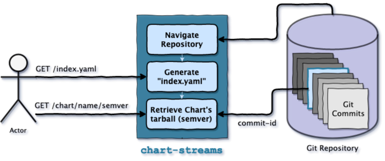

<p align="center">
    <a alt="GoReport" href="https://goreportcard.com/report/github.com/otaviof/chart-streams">
        
    </a>
    <a alt="Code Coverage" href="https://codecov.io/gh/otaviof/chart-streams">
        
    </a>
    <a alt="GoDoc" href="https://godoc.org/github.com/otaviof/chart-streams/pkg/chartstreams">
        
    </a>
    <a alt="GitHub Status" href="https://github.com/isutton/chart-streams/actions/workflows/chart-streams.yaml">
        
    </a>
    </a>
    <a alt="Image Build Status" href="https://quay.io/repository/otaviof/chart-streams">
        
    </a>
</p>


# `chart-streams`

`chart-streams` is a thin layer on top of a Git repository to make it behave as a Helm-Charts
repository would. With the the following advantages:

- Promoting Git repository as source-of-authority over Helm-Charts;
- Low-friction workflow, `index.yaml` and Chart tarballs are generated dynamically;
- Allowing clients to reach branches and commit-ids, with [Semantic Versioning][helmsemver];

The basic workflow is represented as:

<p align="center">
    
</p>

## Usage

The usage of `chart-streams` is regular Helm-Chart repository. Therefore, you can employ Helm in
command-line to interact with this repository. For instance:

```sh
helm repo add cs http://127.0.0.1:8080
helm repo update
helm search ...
```

### Container Image

The container images are stored on [quay.io/otaviof/chart-streams][quayioimage]. To run it, execute:

```sh
podman run --publish=8080:8080 --tmpfs=/var/lib/chart-streams quay.io/otaviof/chart-streams:latest
docker run --publish=8080:8080 --tmpfs=/var/lib/chart-streams quay.io/otaviof/chart-streams:latest
```

### Configuration

Configuration parameters are exposed as environment variables as well, therefore using the prefix
`CHART_STREAMS` you can combine with the option name. For instance, *clone-depth* would then
become `CHART_STREAMS_CLONE_DEPTH` as environment variables, and on command line would then become
`--clone-depth`.

The configuration options available are:

| Parameter    | Default                            | Description                                  |
|--------------|------------------------------------|----------------------------------------------|
| repo-url     | https://github.com/helm/charts.git | Git repository URL                           |
| relative-dir | stable                             | Relative directory in Git repository         |
| clone-depth  | 1                                  | Amount of commits from Git repository        |
| listen-addr  | 127.0.0.1:8080                     | Address the application will be listening on |
| working-dir  | /var/lib/chart-streams             | Git repository working directory             |
| log-level    | info                               | Log verbosity level                          |

Parameter `repo-url` takes the protocol in consideration, therefore you can use a local Git
repository with `--repo-url=file://path/to/local/repo`, for instance.

In order to best performance results, consider always using parameter `working-dir` as a
[tmpfs][tmpfs]. With `docker`/`podman`, a [tmpfs volume][dockertmpfs] can be informed directly on
running a container.

### Example

As a real world example, serve the last 200 commits of [charts][helmstablecharts] repository, with:

```sh
docker run \
    --publish="8080:8080" \
    --tmpfs=/var/lib/chart-streams \
    quay.io/otaviof/chart-streams:latest \
        --clone-depth=200
```

Now, add `chart-streams` as a chart repository:

```sh
helm repo add cs http://127.0.0.1:8080
```

And then, you're able to search for `grafana` in the repository. Notice the `cs/grafana` where
`cs` is the local name of `chart-streams` based repository:

```
$ helm search repo cs/grafana
NAME      	CHART VERSION	APP VERSION	DESCRIPTION
cs/grafana	5.0.6        	6.6.2      	The leading tool for querying and visualizing t..
```

You can also search for `--devel` (development) versions:

```
$ helm search repo cs/grafana --versions --devel
NAME      	CHART VERSION                                     	APP VERSION	DESCRIPTION
[...]
cs/grafana	2.1.0-revert-10682-master-f0cd0f9f                	5.4.3      	The leading tool for querying and visualizing t...
cs/grafana	2.0.2-revert-10682-master-fa4468c8                	5.4.3      	The leading tool for querying and visualizing t...
cs/grafana	1.14.1-update-owners-d09fd18b                     	5.2.3      	The leading tool for querying and visualizing t...
cs/grafana	1.14.0-update-owners-2496eaf3                     	5.2.2      	The leading tool for querying and visualizing t...
```

Therefore, automatically `chart-streams` is displaying branches as development version of your
Helm-Charts, you can reach them as, for instance:

```sh
helm install grafana cs/grafana:2.0.2-revert-10682-master-fa4468c8
```

## Semantic Versioning

Git repository tree is traversed commit-by-commit starting from latest. On traversing the
commits `chart-streams` will identify from which branch each change is coming from, and with this
information publish stable and development versions of Helm-Charts, adding
[semantic versioning][semver] representation [understood by Helm][helmsemver].

Chart versions are ultimately defined by regular `Chart.yaml`, however it's enriched when change is
located in a branch other than `master`. In `master` the exact version present in `Chart.yaml` is
published, while in other branches is enriched with the branch name and short commit identifier.

For instance, lets see how `grafana` version `0.0.1` would be represented from a Git repository
having `master` a `change` branches, where `change` is ahead of master, but `grafana` version is
still the same in `Chart.yaml`.

| Git Reference Name          | Version                 |
|-----------------------------|-------------------------|
| `master` (or `HEAD`)        | `0.0.1`                 |
| `change` (latest commit)    | `0.0.1-change`          |
| `change` (previous commits) | `0.0.1-change-12345678` |

## Endpoints

In order to behave as a Helm-Charts repository, `chart-streams` exposes the following endpoints.

### `/index.yaml`

Dynamically render `index.yaml` payload, representing actual Git repository data as Helm-Charts
repository index. Helm clients are frequently downloading this payload in order to check which charts
and versions are available in the repository.

### `/chart/:name/:version`

Also generated dynamically, this endpoint exposes the "tarball" presenting the chart name (`:name`)
and version (`:version`).

## Contributing

All development dependencies are located at [`Dockerfile.dev`][./Dockerfile.dev]. To use it, run:

```sh
# build development image
make devcontainer-image
# start shell
make devcontainer-run
# execute an arbitrary command
make devcontainer-run DEVCONTAINER_ARGS='make test'
```

For [Visual Studio Code][vscode] users, install [Remote Containers extension][vscodecontainers],
and re-open the project in the container. Please consider [`.devcontainer.json`][.devcontainer.json]
for details.

### Building and Testing

Building the application requires [`libgit2`][libgit2] installed, please consider `Dockerfile.dev`
for details. In order to build the project run:

```sh
make
```

And in order to run automated tests, execute:

```sh
make test
```

Additionally, consider [`.editorconfig`](./.editorconfig) file for code standards, and
[`.travis.yml`](./.travis.yml) for the continuous integration steps.

[dockertmpfs]: https://docs.docker.com/storage/tmpfs
[gnumake]: https://www.gnu.org/software/make
[golang]: https://golang.org
[helmsemver]: https://helm.sh/docs/topics/chart_best_practices/conventions
[helmstablecharts]: https://github.com/helm/charts.git
[libgit2]: https://libgit2.org
[quayioimage]: https://quay.io/repository/otaviof/chart-streams
[semver]: https://semver.org
[tmpfs]: https://en.wikipedia.org/wiki/Tmpfs
[vscode]: https://code.visualstudio.com/
[vscodecontainers]: https://marketplace.visualstudio.com/items?itemName=ms-vscode-remote.remote-containers
