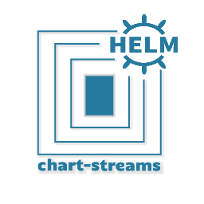

    

    
<!--
    
  -->
    
    
<!--
    
  -->

# `chart-streams`

`chart-streams` is a thin layer on top of a Git repository to make it behave as a Helm-Charts
repository would. With the the following advantages:

- keeping all charts data in a single place
- being able to on-the-fly generate `index.yaml`;
- use `semver` to retrieve a chart in a given `commit-id`/`branch`;

The basic workflow is represented as:

    

